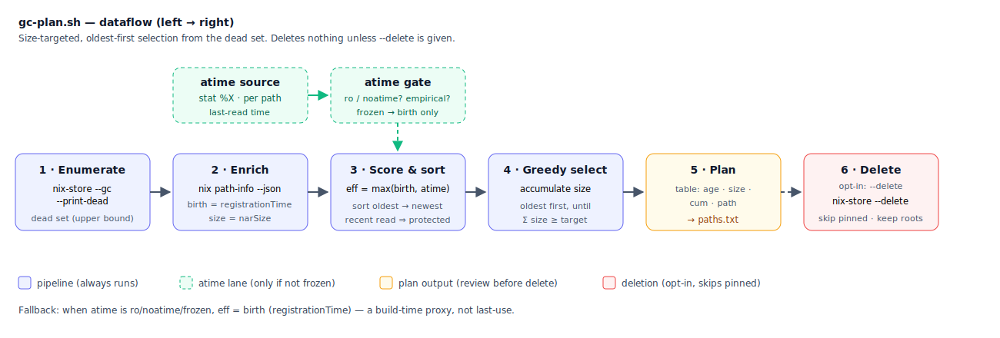

# nix-better-gc

A least-recently-used-*ish* garbage-collection planner for the Nix store.

`nix-collect-garbage` is all-or-nothing: it deletes **every** dead (unreferenced)
path. For a development machine that churns through nix-shells and branch
switches, that means throwing away libraries you will need again in an hour and
paying to rebuild or re-substitute them. `gc-plan.sh` instead frees **only as
much as you ask for**, taking the **oldest** dead paths first and protecting the
recently-used ones.

By default it **deletes nothing** — it prints a plan and writes the selected
store paths to a file for you to review.

```
./gc-plan.sh 10G          # what would I delete to free ~10 GiB? (plan only)
./gc-plan.sh 10G --delete confirm    # ...and actually delete after a y/N prompt
```

## Why not just use existing tools?

Nix has no built-in LRU or size-targeted GC. The feature has been requested for
years (see [Prior art](#prior-art)). The two usable signals are:

| Signal | Means | Reliable? |
|---|---|---|
| `registrationTime` (Nix DB) | when the path was **born** (built/substituted) | always available; durable |
| `mtime` | — | useless: Nix zeroes it to `1970-01-01` for reproducibility |
| `atime` (filesystem) | when the path was **last read** | only if the store filesystem maintains it |

`atime` is the signal you actually want (last *use*), but it is frequently
unavailable: a **read-only** store mount freezes it, `noatime` disables it, and
`relatime` (the common default) only advances it once per 24 h. On a typical
NixOS box `/nix/store` is bind-mounted `ro`, so atime never moves — reading a
file does **not** update its atime. In that case the only honest signal left is
`registrationTime` (birth), which is a *proxy*: it orders by when you built
things, not when you last used them.

This script uses atime when it can prove it's meaningful, and falls back to
`registrationTime` when it can't — never silently pretending a frozen atime is a
usage signal.

## How it works



1. **Enumerate** dead paths via `nix-store --gc --print-dead` (walks all gc-roots).
2. **Score** each path by an *effective* timestamp = `max(registrationTime, atime)`.
   A path read recently sorts to the "young / keep" end and is protected.
3. **Detect** whether atime is trustworthy for this store, in two stages:
   - *Structural*: inspect the store mount options. `ro` or `noatime` → atime off.
   - *Empirical*: even on an `rw` mount, check whether **any** dead path shows an
     atime later than its birth. If none do, atime is frozen/degenerate and is
     downgraded to unused (under `--atime auto`).
4. **Select** greedily, oldest-first, accumulating `narSize` until your target
   is reached.
5. **Report** a table and write the selected paths to `gc-plan-paths.txt`.
6. **Optionally delete** (`--delete confirm|force`): walk the full dead list
   oldest-first and ask `nix-store --delete` for each. Paths that Nix still
   considers alive (pinned by `keep-derivations`/`keep-outputs` from a rooted
   output) are **skipped**, not forced. gc-roots and `result` pins are never
   touched. Deletion stops once the *actually-freed* total meets the target.

### Output columns

```
EFF_AGE  BIRTH    ATIME    SIZE       CUM  PATH
15d      15d      -        3.2KiB   3.2KiB  /nix/store/…-post.md
7d       7d       -       51.7MiB  488.9MiB /nix/store/…-git-2.49.0
```

- **EFF_AGE** — age by the effective (sort) timestamp; this is the selection order.
- **BIRTH** — age by `registrationTime`.
- **ATIME** — age by last read, or `-` when atime is unused/unavailable.
- **SIZE** — the path's `narSize` (nar bytes, not on-disk; hardlink sharing means
  real freed space is usually less).
- **CUM** — running total; where this crosses your target is where the plan cuts.

## Usage

```
./gc-plan.sh <target> [options]

  <target>              10G | 500MiB | 41GiB | 2000000000 (plain bytes)

  -o FILE               write selected paths here (default: gc-plan-paths.txt)
  --atime auto|on|off   atime handling (default: auto — detect & verify)
  --delete no|confirm|force
                        no      = plan only, delete nothing (default)
                        confirm = show plan, then prompt [y/N]
                        force   = delete the plan without prompting
```

Examples:

```bash
# Plan only. Table on stdout, progress/summary on stderr — safe to redirect:
./gc-plan.sh 20G > plan.txt

# Free ~5 GiB, oldest-first, after confirming interactively:
./gc-plan.sh 5G --delete confirm

# Force atime off (e.g. you know your rw mount's atime is noise):
./gc-plan.sh 10G --atime off
```

### Requirements

`nix` (with `nix-command` — the script enables it per-invocation), `jq`,
`coreutils` (`numfmt`, `stat`, `date`), `gawk`, and `findutils` (`xargs`). The
`mount` command is used *if present* for atime detection but is not required.
The script checks all of these at startup and refuses to run (even `--help`) if
any are missing. When installed via the flake, every dependency is wrapped onto
`PATH`, so nothing needs to be installed globally.

### Portability (Linux and macOS)

The script is POSIX-friendly and does **not** read `/proc` or use any
Linux-specific tool. Mount options are discovered by parsing the portable
`mount` command, which handles both Linux (`… type ext4 (ro,relatime)`) and
macOS/BSD (`… (apfs, local, read-only, noatime)`) formats, including the macOS
`read-only` spelling of `ro`. If `mount` is unavailable or its output can't be
matched, atime handling falls back to the **empirical** check — it looks at the
actual dead paths and only trusts atime if at least one shows a read *after* its
birth — so correctness never depends on the structural probe. The flake pulls in
`util-linux` for `mount` on Linux and relies on the system `/sbin/mount` on macOS.

## Install

The flake packages `gc-plan` with all runtime deps wrapped onto `PATH`, so it
runs anywhere without a dev shell:

```bash
nix run github:eisbaw/nix-better-gc -- 10G      # run without installing
nix profile install github:eisbaw/nix-better-gc # install `gc-plan` onto PATH
nix build github:eisbaw/nix-better-gc           # build → ./result/bin/gc-plan
```

Non-flake (`callPackage`) consumers can use `default.nix` directly:

```bash
nix-build -E '(import <nixpkgs> {}).callPackage ./default.nix {}'
```

## Development

A flake pins the tooling (shellcheck, just, and the script's runtime deps):

```bash
nix develop            # enter the dev shell
just                   # list recipes
just check             # shellcheck gc-plan.sh
just plan 10G          # run a plan
```

The package definition lives in `default.nix` (callPackage form); the flake
imports it via `pkgs.callPackage ./default.nix {}` and exposes it as
`packages.default` / `apps.default`. `shellcheck` runs at build time, so a lint
failure fails the build.

## Caveats and limitations

Read these — the tool is deliberately honest about what it can and cannot know.

- **`registrationTime` is birth, not last use.** On a store where atime is frozen
  (the common `ro` NixOS case), ordering is purely "oldest-built first." A stable
  library you used five minutes ago but built two months ago will be selected
  *before* junk you built today. Only real last-access tracking (see prior art)
  fixes this fundamentally.
- **atime is a soft hint at best.** It's read on the store path (a directory for
  most paths); under `relatime` it advances at most once/24 h, and a directory's
  atime reflects when it was *listed*, which can lag reads of files inside it.
- **`--print-dead` over-reports.** A dead-listed path (often a `.drv`) can still
  be pinned alive by `keep-derivations`/`keep-outputs`. The plan's total is an
  **upper bound**; `--delete` skips such paths and keeps going, so the *actually*
  freed amount can be less than the plan showed.
- **nar bytes ≠ disk bytes.** Sizes are `narSize`. Hardlink deduplication
  (`nix-store --optimise`) means real reclaimed space is usually smaller —
  check `df` after deleting.
- **TOCTOU.** There is a gap between "list dead" and "delete." A path can become
  live again in between; `nix-store --delete` will refuse it (skipped), so this is
  safe, just occasionally less effective than the plan implied.
- **No true LRU across invocations.** There is no persistent access history; each
  run only knows the atime/birth visible at that moment.

## Prior art

This tool is one point in a long-running design space. Background and the
discussions that informed it:

- **NixOS/nix#7572** — *"nix-store --gc could remove least-recently-used paths
  first"*: the canonical, still-open feature request. Contains the key design
  threads — `min-free`/`max-free` interplay, kevincox's proposal for a
  `registrationTime`-based `--min-path-age` gate, Lillecarl's argument for a
  daemon-tracked `lastReferencedTime`, tejing1's gcroot-expiry design, and
  Popax21's plan to upstream an `--older-than` MVP.
  <https://github.com/NixOS/nix/issues/7572>
- **NixOS/nix#7749** — *"make nix-store --gc to work as LRU"*: closed as a
  duplicate of #7572. Its original poster shipped a first-cut atime-sorting shell
  script, the spiritual ancestor of this one.
  <https://github.com/NixOS/nix/issues/7749>
- **risicle/nix-heuristic-gc** — a Python+C++ tool that GCs to a size/inode
  target using weighted heuristics (atime, substitutability, `.drv`-ness, size).
  Its `--inherit-atime` option and the author's notes on why atime alone is
  insufficient (a path needed via a now-removed parent looks idle) directly
  motivate the caveats above.
  <https://github.com/risicle/nix-heuristic-gc>
- **Lillecarl's Lix patch** — a proof-of-concept adding a `lastReferencedTime`
  updated over the daemon protocol on build/copy, i.e. real last-*use* tracking
  rather than a filesystem/birth proxy. The "correct but needs new DB state"
  end of the spectrum.
  <https://github.com/Lillecarl/lix/commit/9ac72bbd0c7802ca83a907d1fec135f31aab6d24>

### Where this tool sits

`gc-plan.sh` is the pragmatic middle: no daemon changes, no new DB columns, no
persistent state — just the signals already on disk (`registrationTime` always,
atime when provably meaningful), a size target, and a review-before-delete
workflow. For genuine last-access LRU, the Lix `lastReferencedTime` approach or
an external access observatory (e.g. `fanotify`/eBPF watching opens under
`/nix/store`) is the real fix; this is the version you can run today.

## License

MIT — see [LICENSE](LICENSE).
